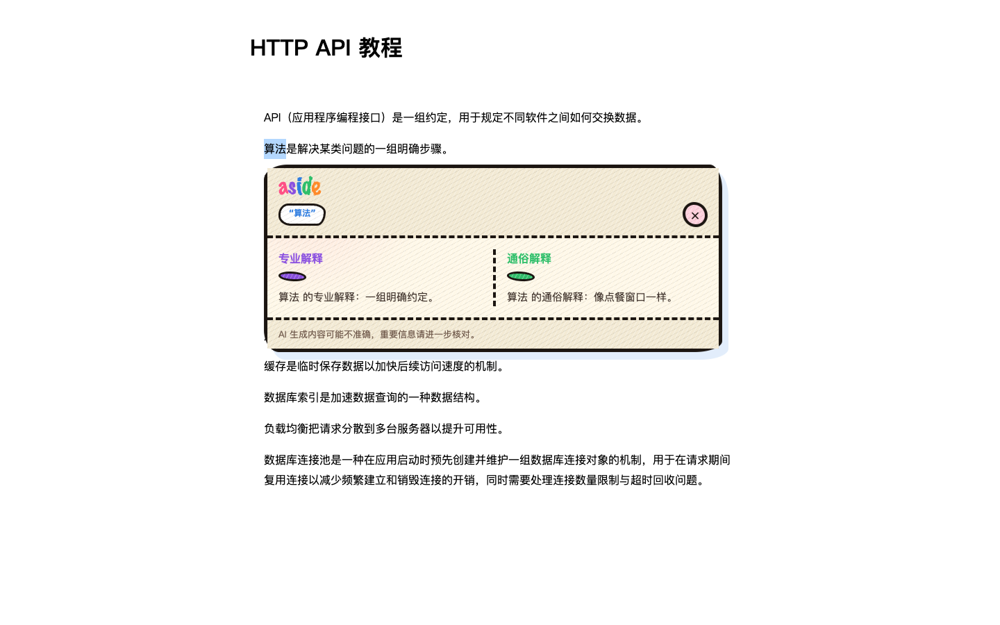

# Aside

看教程时遇到看不懂的词，选中它，旁边会出现「解释这个词」。点一下就能看到两栏：一栏专业一点，一栏用大白话讲。不用切走当前页。

卡片里也可以再划一个词，继续问。

Aside 不提供模型，也不代收费用。你自己填接口地址、密钥和模型名称，DeepSeek、通义、智谱，或其他 OpenAI 兼容服务都可以。



## 安装

Chrome 桌面版 116 以上，电脑上要有 Node.js（建议 22）：

```bash
git clone https://github.com/Gary-Luo1/Aside.git
cd Aside
npm install
npm run extension:build
```

打开 `chrome://extensions`，打开开发者模式，加载已解压的扩展程序，选 `extension/dist/`。

配置接口有两种方式。想省事就在任意网页上划一个词，点「解释这个词」，卡片里会直接给出三个输入框，填完保存后立即生效并开始解释，不用离开当前页。也可以点工具栏的 Aside 图标打开设置，三项填好后先「测试连接」（Chrome 可能会问你是否允许访问这个接口网站），通过了再保存。接口地址用 `https`；本机调试可以用 `http://localhost` 或 `http://127.0.0.1`。

更细的步骤见 [安装说明](docs/install-guide.md)。更新内容见 [更新日志](CHANGELOG.md)。

## 使用时注意

只支持普通网页。浏览器内部页、扩展商店、本地文件、PDF、图片或 Canvas 上的字用不了。选区超过 60 字，或中间有换行，也不会发出去。

有的网页禁止选字。在文字上按下鼠标，一般就能选；页面如果还拦复制，可能还是选不了。

密钥只存在你这台电脑的浏览器里。发出去的只有你点了「解释这个词」的那几个字，没有标题、网址，也没有旁边的段落。详见 [隐私说明](docs/privacy.md)。

解释是模型生成的，可能不准，重要信息自己再核对。

## 开发

```bash
npm install
npm run extension:typecheck
npm run extension:build
npm run extension:check   # 类型检查 + 构建
```

## 许可证

[MIT](LICENSE)
