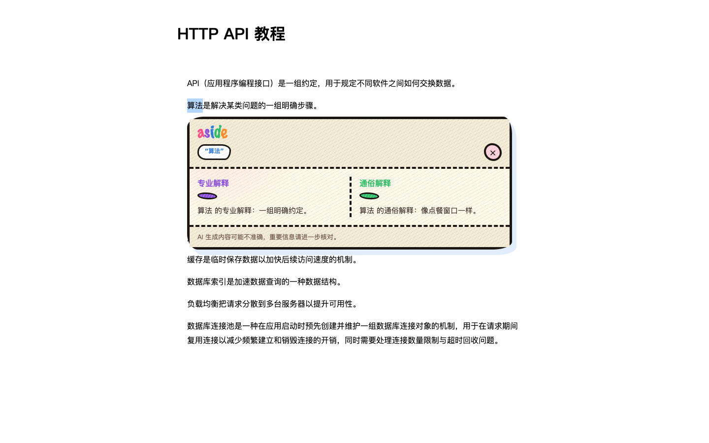

# Aside

选中教程里的专业名词，不离开页面，就地获得「专业解释」和「通俗解释」两层说明。

面向**会自行配置 OpenAI 兼容接口**的人：你自备 Base URL、API Key 和 Model。插件不提供模型服务，也不代收费用。

## 功能

- 网页划词 → 选区附近出现不抢焦点的紧凑「解释这个词」入口 → 双栏解释卡片（专业 + 通俗）
- 窄屏自动纵向排列，长文本可展开
- 使用你自己配置的 OpenAI 兼容接口（DeepSeek、通义、智谱、OpenAI 兼容服务等）
- 连接测试时向 Chrome 申请**仅该接口地址**的访问权限
- 保存、修改与删除配置
- 网页用 CSS 禁止选择时，按下鼠标即可在该处划词
- 支持普通 HTTP/HTTPS 页面及其同源、跨源 iframe 中的 DOM 文本

隐私优先：只把「你选中的那个词」发送到你自己的接口地址，不读取段落、标题或网址。完整说明见 [docs/privacy.md](docs/privacy.md)。商店权限说明与截图清单见 [docs/store-listing.md](docs/store-listing.md)。



## 安装

### 方式一：Release 压缩包（推荐）

1. 在 Releases 页面下载最新版的扩展压缩包并解压。
2. 打开 Chrome，访问 `chrome://extensions`，打开右上角「开发者模式」。
3. 点击「加载已解压的扩展程序」，选择解压后的文件夹。

### 方式二：自行构建

```bash
npm install
npm run extension:build
```

构建产物在 `extension/dist/`，按方式一第 2、3 步加载即可。

详细的安装与配置说明见 [docs/install-guide.md](docs/install-guide.md)。

## 配置 AI 接口

点击工具栏的 Aside 图标打开设置页，填写三项：

- **API Base URL**：以 `https` 开头的 OpenAI 兼容接口地址（本地调试可用 `http://localhost` / `http://127.0.0.1`）
- **API Key**：向模型厂商申请的密钥，建议使用独立、可撤销、有限额的密钥
- **Model**：模型名称（如 `gpt-4o`、`qwen-plus`），以厂商实际名称为准

点击「测试连接」时，Chrome 可能提示允许访问该接口网站；允许后测试成功即可保存使用。每次解释会向该接口请求一次，费用由厂商收取。

## 隐私与安全

- 插件不扫描页面、不读取选中词以外的内容，不发送页面标题或网址。
- API Key 只保存在浏览器本地存储中，并限制为受信任的扩展上下文读取。
- 选词、解释、配置相关的安全设计详见 [CONTEXT.md](CONTEXT.md) 与源码。
- AI 生成内容可能不准确，重要信息请进一步核对。

## 页面支持边界

- 选中文字后插件只显示被动入口，不会自动抢走页面焦点；复制、右键和网页自己的复制处理保持原样。
- 网页用 CSS 禁止选择时，按下鼠标即可在该处划词；拦复制脚本、图片/Canvas 上的字、PDF 查看器仍可能选不了。
- 浏览器内部页面（如 `chrome://`）、扩展商店页面、PDF/特殊文档查看器、图片或 Canvas 中的文字、复杂编辑器专用选区，以及 `about:` / `data:` / `blob:` 等特殊来源 frame 不在支持范围内。
- 如果 Chrome 将网站访问权限限制为“点击时”或未允许当前网站，插件不会绕过浏览器权限。

## 开发

```bash
npm run extension:typecheck   # TypeScript 类型检查
npm run extension:test        # 单元 + 集成测试
npm run extension:test:e2e    # 端到端测试（无窗口；需本机已安装 Playwright Chromium）
npm run extension:build       # 构建扩展（输出 extension/dist）
npm run extension:check       # 全量检查：类型 + 测试 + E2E + 构建
```

测试覆盖：单元/集成与端到端（真实鼠标拖选、键盘选词、受保护页面、iframe、密钥隔离等）。

## 许可证

[MIT](LICENSE)
