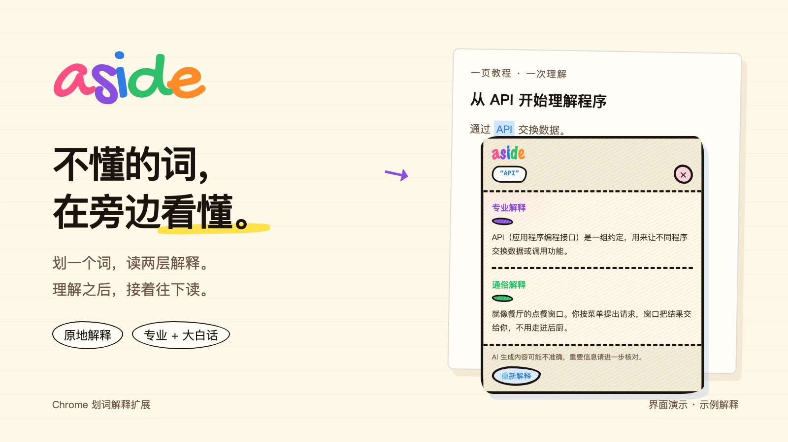
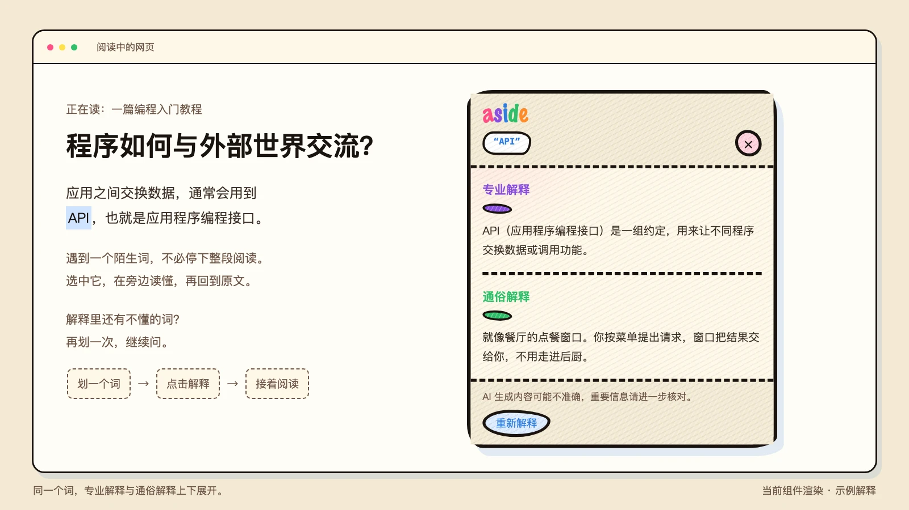

# Aside

**不懂的词，在旁边看懂。**



Aside 是一个 Chrome 划词解释扩展。读教程、看文章时，选中一个陌生词，点击「解释这个词」，就能在当前页面读到专业解释和大白话解释。

在解释卡片里还可以继续划词追问。理解之后，接着往下读。

[快速开始](#快速开始) · [安装与使用](docs/install-guide.md) · [隐私说明](docs/privacy.md) · [更新日志](CHANGELOG.md)

## 看它怎么解释



*图中使用当前卡片组件和预置示例解释，展示阅读方式；实际解释由你配置的模型生成。*

## 快速开始

需要 **Chrome 桌面版 116 及以上**、**Node.js 22.6 及以上**，以及一个可用的 OpenAI 兼容模型接口。

### 1. 构建并加载

```bash
git clone https://github.com/Gary-Luo1/Aside.git
cd Aside
npm install
npm run extension:build
```

打开 `chrome://extensions`，开启「开发者模式」，点击「加载已解压的扩展程序」，选择 `extension/dist/`。

### 2. 配置你的模型

点击浏览器工具栏中的 Aside 图标，填写**接口地址、密钥、模型名称**，测试连接通过后保存。内置 DeepSeek、通义、智谱预设，也可填写其他 OpenAI 兼容服务；以连接测试结果为准。

也可以在网页中划词并点击「解释这个词」，直接在卡片里配置，测试通过后开始解释。在不信任的网页上，建议从工具栏进入设置页填写密钥。

Aside 不提供模型，也不代收费用；接口调用费用由你选择的模型厂商收取。

### 3. 划一个词，开始阅读

在普通网页上选中一个词，点击「解释这个词」。卡片会上下展开专业解释和通俗解释；还没看懂的词，可以在解释正文里再次划选。需要换个说法时点「重新解释」，按 `Esc` 或点击关闭按钮继续阅读。

详细步骤见 [安装与使用说明](docs/install-guide.md)。

## 使用范围与隐私

- 支持普通 HTTP/HTTPS 网页上的文字，包括 iframe 内的文字；浏览器内部页、扩展商店、本地文件、PDF、图片及 Canvas 文字无法使用。
- 单次选词最多 60 字，不能包含换行。网页的选字限制和浏览器网站访问权限也可能影响使用。
- 密钥只保存在当前浏览器本地。解释请求只发送你主动点击解释的选中文字，不发送网页标题、网址或周围段落。
- Aside 没有自有服务器，也不保存查询历史；请求直接发往你填写的模型接口，厂商的数据处理方式以其政策为准。
- 解释由 AI 生成，可能不准确，重要信息请进一步核对。

配置删除和数据流向见 [隐私说明](docs/privacy.md)。

## 开发

```bash
npm install
npm run extension:check  # 类型、lint、格式、测试与构建
```

## 许可证

[MIT](LICENSE)
